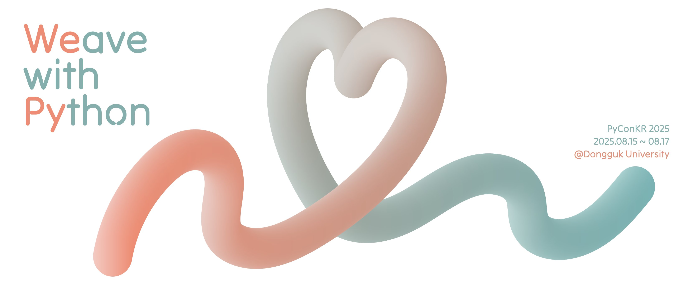
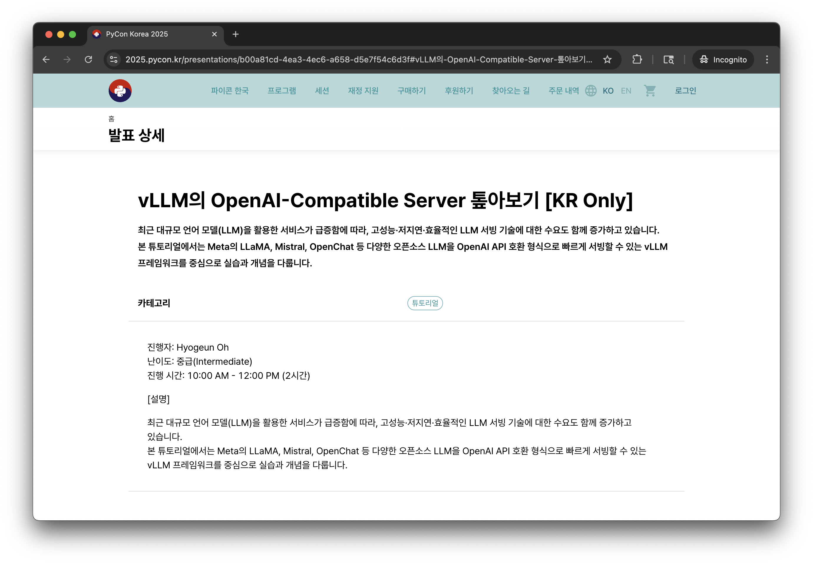
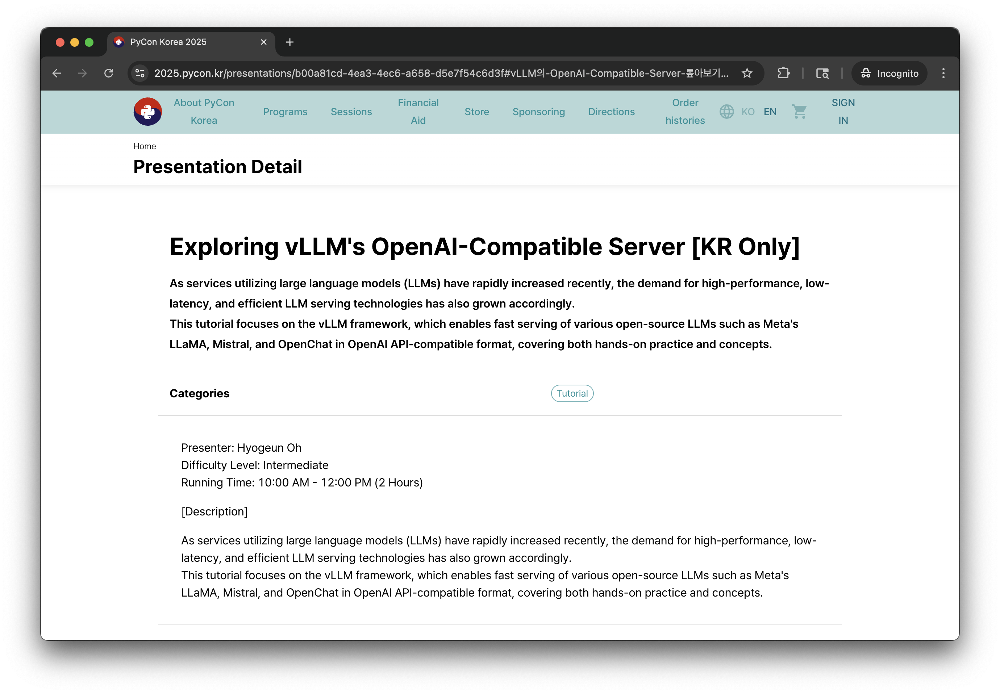
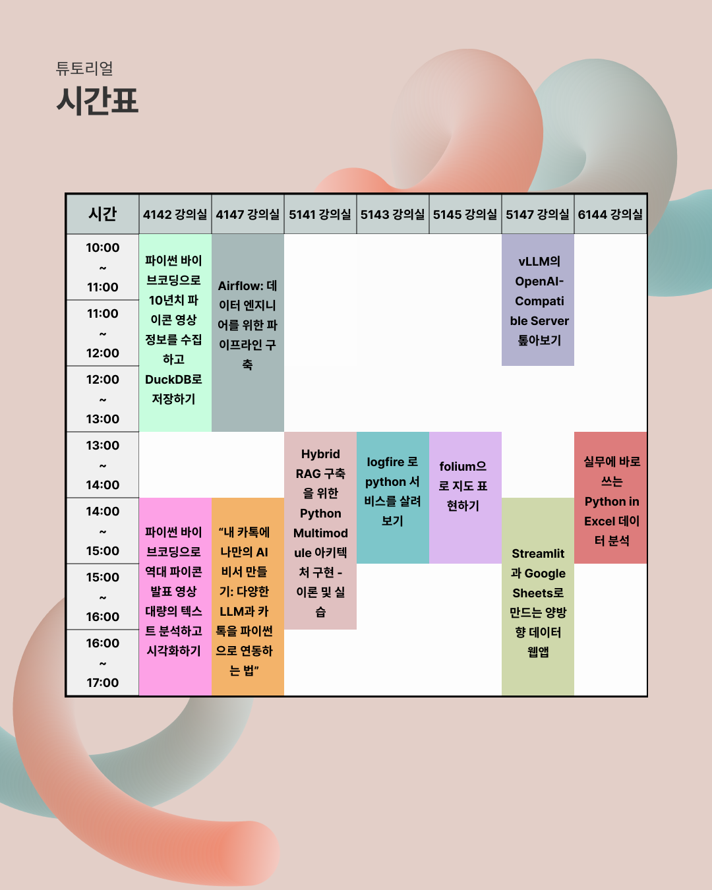

<h2 align="center">🐍 vLLM의 OpenAI-Compatible Server 톺아보기 🐍</h2>

<h4 align="center">PyCon Korea Tutorial, 2025</h4>

<p align="center">
    <a href="https://www.slideshare.net/slideshow/vllm-openal-compatible-server-pycon-korea-tutorial-2025-0cff/282420006" target="_blank">
        
    </a>
    <a href="REFERENCES.md" target="_blank">
        
    </a>
</p>

<div align="center">
    <a href="https://2025.pycon.kr/presentations/b00a81cd-4ea3-4ec6-a658-d5e7f54c6d3f" target="_blank">
        
    </a>
</div>

<h3 align="center">How to Setup?</h3>

1. [`uv`](https://docs.astral.sh/uv/) 설치

```bash
wget -qO- https://astral.sh/uv/install.sh | sh
```

2. 의존성 및 실습에 사용할 `Qwen/Qwen3-0.6B` 설치

```bash
make init
```

<h3 align="center">How to Run?</h3>

```bash
uv run src/${PYTHON_SCRIPT}.py
# or
src/${PYTHON_SCRIPT}.py
```

<h3 align="center">Tutorial Details</h3>

<table align="center">
  <tr>
    <th>Korean</th>
    <th>English</th>
  </tr>
  <tr>
    <td>
      
    </td>
    <td></td>
  </tr>
  <tr>
    <td></td>
    <td></td>
  </tr>
</table>
